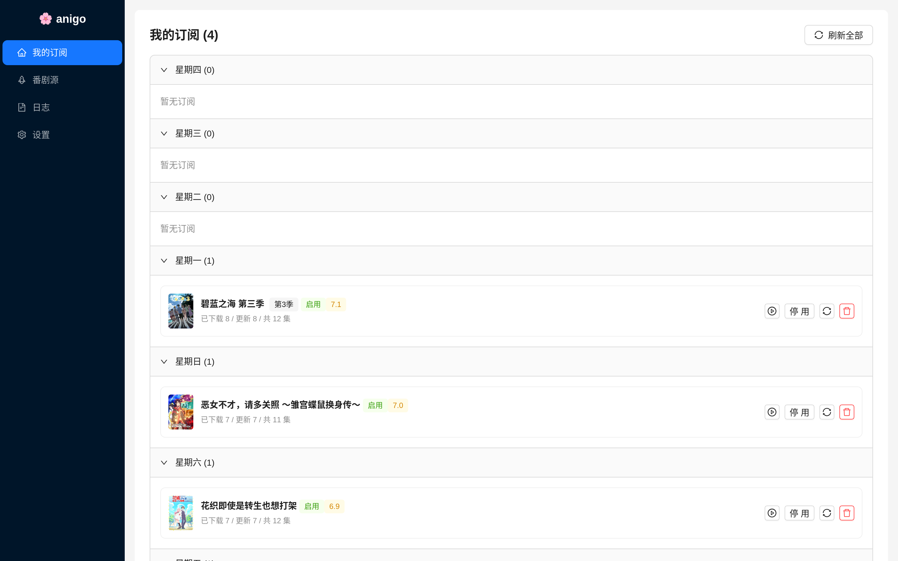
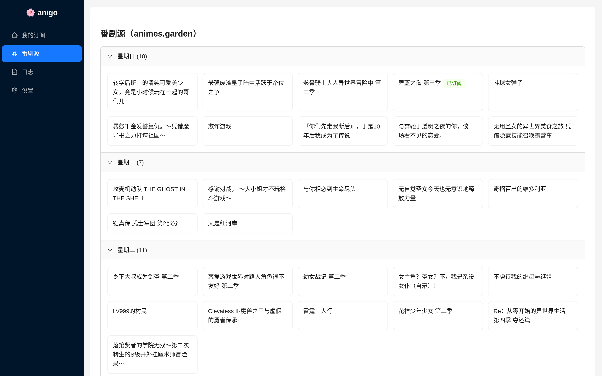
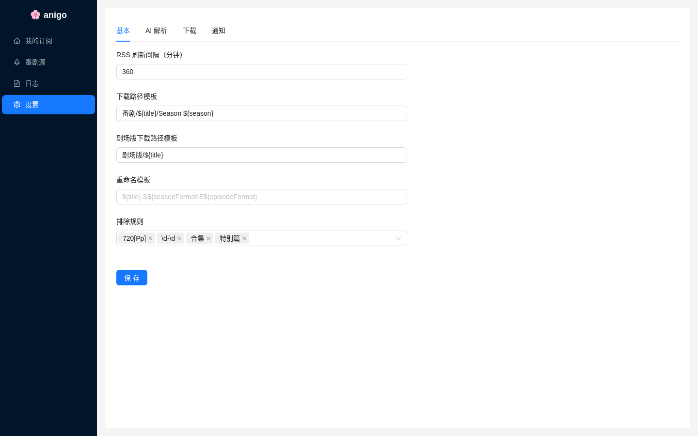
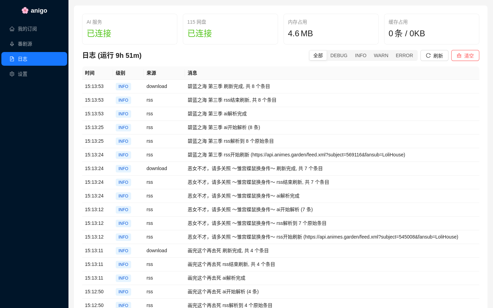
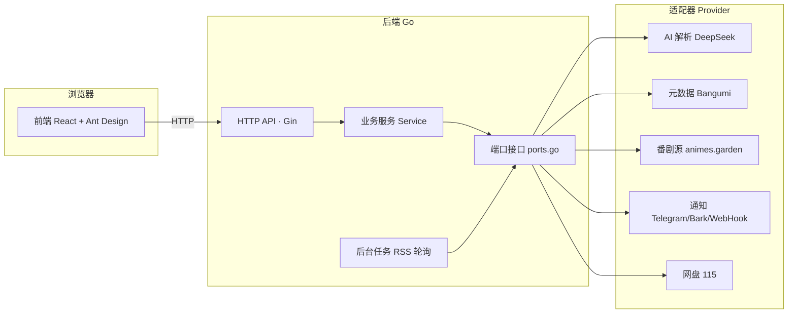

<div align="center">


# AniGo

**云端追番 · 自动下载 · 智能选版**

订阅动画 RSS，AI 智能解析，自动离线下载到网盘，通知推送，多设备管理。**全程不占本地硬盘，单二进制部署。**

<p align="center">
  
  
  
  
  
  
</p>

[快速开始](#快速开始) · [核心特性](#核心特性) · [配置指南](#配置指南) · [项目结构](#项目结构) · [架构设计](#架构设计)

</div>

---

## 界面预览

| 首页 · 我的订阅 | 番剧源 |
| :---: | :---: |
|  |  |

| 设置 | 日志 |
| :---: | :---: |
|  |  |

## 核心特性

<table>
  <thead>
    <tr>
      <th width="220" align="center">能力</th>
      <th>说明</th>
    </tr>
  </thead>
  <tbody>
    <tr><td align="center"><b>云端追番</b></td><td>RSS 自动离线下载到 115 网盘，本地零存储</td></tr>
    <tr><td align="center"><b>AI 解析</b></td><td>DeepSeek 等大模型批量解析标题，提取集数 / 分辨率 / 字幕组 / 选版信号，同步完成规则与简中字幕筛选</td></tr>
    <tr><td align="center"><b>智能选版</b></td><td>同集多版本自动择优（分辨率 > 压制源 > 编码 > 色深 > 字幕嵌入/语言），每集不重复下载</td></tr>
    <tr><td align="center"><b>四源聚合</b></td><td><a href="https://animes.garden">animes.garden</a>（動漫花園 + 蜜柑 + 萌番组 + ANi 聚合）作番剧源</td></tr>
    <tr><td align="center"><b>在线播放</b></td><td>首页直接调用系统播放器（mpv 等）经本地代理播放 115 云端文件，无需下载</td></tr>
    <tr><td align="center"><b>元数据</b></td><td>Bangumi 评分 / 季数 / 总集数、封面下载</td></tr>
    <tr><td align="center"><b>通知</b></td><td>Telegram / Bark / ServerChan / WebHook / Shell / 系统日志</td></tr>
    <tr><td align="center"><b>单二进制</b></td><td>前端 React 构建产物嵌入后端，一个 <code>anigo</code> 搞定</td></tr>
    <tr><td align="center"><b>多设备</b></td><td>服务器部署，任意设备浏览器访问管理</td></tr>
  </tbody>
</table>

## 快速开始

### 环境要求

- **Go 1.26+**（构建）
- **Node.js 20+**（构建前端，`make all` 会先构建前端再嵌入）

### 构建

```bash
make all    # 前端 + 后端一体构建，产物 backend/bin/anigo
```

若只改后端、前端已构建：

```bash
make build  # 仅构建后端（使用已嵌入的前端）
```

### 运行

```bash
./backend/bin/anigo               # 默认端口 7789，配置目录 ./config
PORT=9000 ./backend/bin/anigo     # 自定义端口
CONFIG=/path ./backend/bin/anigo  # 自定义配置目录
```

首次启动自动生成 `config.v2.json` / `ani.v2.json`。浏览器打开 `http://服务器:7789` 即可管理。

### 开发模式（前后端热更新）

```bash
make dev    # 后端 :7789 + Vite 热更新 :37789（/api 自动代理）
```

### 测试

```bash
make test                      # 后端：go vet ./... && go test ./...
cd frontend && npm run test    # 前端：vitest（组件/API）
make e2e                       # 端到端集成测试（需真实外部服务：AI/115/BGM/animes.garden）
```

覆盖范围：后端单元测试（store/util/domain/rename/rss/service/provider）、前端测试（API client/App 路由/SideMenu 导航）、E2E（基础 API/配置/AI/元数据/RSS/订阅/115 登录/通知/导出导入）。

## 配置指南

### 下载路径模板

默认 `番剧/${title}/Season ${season}`，支持占位符：

```
${title} ${season} ${seasonFormat} ${episode} ${episodeFormat}
${letter} ${quarter} ${quarterName} ${year} ${month} ${monthFormat}
${bgmId} ${jpTitle} ${subgroup}
```

### 通知模板

配置多条通知渠道（Telegram/Bark/ServerChan/WebHook/Shell/系统日志），每条可设定：

- **触发状态**：下载开始 / 完成 / 缺集 / 错误 / 完结 / 摸鱼
- **模板**：`${text} ${title} ${season} ${episode} ${emoji} ${action}` 等
- **重试次数、排序、备注**

> [!NOTE]
> **在线播放（可选）**：首页订阅卡片点击播放图标，通过 `mpv-handler://` 协议拉起系统播放器（mpv 等）观看 115 云端文件。需安装并注册 [mpv-handler](https://github.com/akiirui/mpv-handler)；前端经本地 `/api/file` 代理转发 115 CDN 流，播放器只访问本地端点，不暴露云端地址。

> [!NOTE]
> **扫码获取 115 Cookie**：`scripts/qrcode_cookie_115.py` 可扫码登录 115 并打印 Cookie（`UID=...; CID=...; SEID=...; KID=...`）。安装 `pip install qrcode` 后运行 `python scripts/qrcode_cookie_115.py`，免去手动复制。出处：[ChenyangGao/qrcode_cookie_115](https://gist.github.com/ChenyangGao/d26a592a0aeb13465511c885d5c7ad61)

## 项目结构

```
anigo/
├── backend/                  # 后端 Go
│   ├── cmd/anigo/            # 入口（DI 组装）
│   └── internal/
│       ├── domain/           # 领域模型 + 端口接口（ports.go）
│       ├── store/            # JSON 文件持久化 + TTL 缓存
│       ├── service/          # 业务服务（订阅/下载/通知/元数据/状态）
│       ├── provider/         # 适配器：bgm/garden/ai/notifier
│       ├── cloud/            # 网盘驱动（driver_115）
│       ├── rss/ rename/      # 纯函数：RSS 解析/剧集提取/重命名
│       ├── httpapi/          # Gin HTTP 层 + 嵌入前端
│       └── task/             # 后台任务循环（RSS 轮询）
├── frontend/                 # 前端 React + TS + Ant Design
│   ├── src/pages/            # 首页/番剧源/设置/日志页面
│   └── src/**/*.test.tsx     # vitest 组件与 API 测试
├── scripts/                  # 辅助脚本
│   ├── e2e.sh                # 端到端集成测试
│   └── qrcode_cookie_115.py  # 扫码获取 115 Cookie（第三方脚本）
├── docs/                     # 架构设计文档（architecture.md / pipeline.md）
├── Makefile                  # 构建/开发/测试统一入口
└── go.work                   # Go workspace（backend 模块）
```

## 架构设计



**技术栈：**

| 层 | 选型 |
| --- | --- |
| 后端 | Go 1.26 + Gin |
| 前端 | React + TypeScript + Vite + Ant Design |
| 存储 | 标准库 JSON 文件 |
| 日志 | `log/slog` 结构化日志 |

> 详见 [`docs/architecture.md`](docs/architecture.md) 与 [`docs/pipeline.md`](docs/pipeline.md)。

## License

本项目采用 [GNU General Public License v3.0](LICENSE)（GPL-3.0）。

> 免责声明：本工具为中立性技术辅助工具，请遵守当地法律法规，勿用于盗版传播。

## 致谢

- [ani-rss](https://github.com/wushuo894/ani-rss) — 思路与契约格式来源
- [mpv-handler](https://github.com/akiirui/mpv-handler) — mpv 在线播放协议
- [ChenyangGao/qrcode_cookie_115](https://gist.github.com/ChenyangGao/d26a592a0aeb13465511c885d5c7ad61) — 115 扫码登录获取 Cookie 脚本

---

<p align="center">Made with ❤️ · AniGo</p>