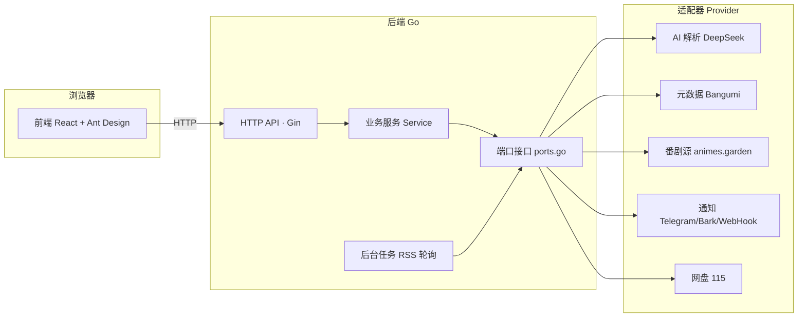

<div align="center">


# AniGo

**云端追番 · 自动下载 · 智能选版**

订阅动画 RSS，AI 智能解析，自动离线下载到网盘，通知推送。**全程不占本地硬盘，单二进制部署。**

<p align="center">
  
  
  
  
  
  
</p>

[快速开始](#快速开始) · [核心特性](#核心特性) · [配置指南](#配置指南) · [项目结构](#项目结构) · [架构设计](#架构设计)

</div>

---

## 界面预览

| 首页 · 我的订阅 | 番剧源 |
| :---: | :---: |
|  |  |

| 设置 | 日志 |
| :---: | :---: |
|  |  |

## 核心特性

<table>
  <thead>
    <tr>
      <th width="220" align="center">能力</th>
      <th>说明</th>
    </tr>
  </thead>
  <tbody>
    <tr><td align="center"><b>云端追番</b></td><td>RSS 自动离线下载到 115 / PikPak 网盘，本地零存储</td></tr>
    <tr><td align="center"><b>AI 解析</b></td><td>DeepSeek 等大模型批量解析标题，提取集数 / 分辨率 / 字幕组 / 选版信号，同步完成规则与简中字幕筛选</td></tr>
    <tr><td align="center"><b>智能选版</b></td><td>同集多版本自动择优（分辨率 > 压制源 > 编码 > 色深 > 字幕嵌入/语言），每集不重复下载</td></tr>
    <tr><td align="center"><b>四源聚合</b></td><td><a href="https://animes.garden">animes.garden</a>（動漫花園 + 蜜柑 + 萌番组 + ANi 聚合）作番剧源</td></tr>
    <tr><td align="center"><b>在线播放</b></td><td>首页直接调用系统播放器（mpv 等）经本地代理播放 115 / PikPak 云端文件，无需下载</td></tr>
    <tr><td align="center"><b>元数据</b></td><td>Bangumi 评分 / 季数 / 总集数、封面下载，后台定时刷新（周期可配）</td></tr>
    <tr><td align="center"><b>通知</b></td><td>Telegram / Bark / ServerChan / WebHook / Shell / 系统日志</td></tr>
    <tr><td align="center"><b>单二进制</b></td><td>前端 React 构建产物嵌入后端，一个 <code>anigo</code> 搞定</td></tr>
  </tbody>
</table>

> [!NOTE]
> 支持 **115 网盘**（Cookie）和 **PikPak**（邮箱/手机号与密码）离线下载，可在「设置 → 下载」中选择。

## 快速开始

### 环境要求

- **Go 1.26+**（构建）
- **Node.js 20+**（构建前端，`make all` 会先构建前端再嵌入）

### 构建

```bash
make all    # 前端 + 后端一体构建，产物 backend/bin/anigo
```

若只改后端、前端已构建：

```bash
make build  # 仅构建后端（使用已嵌入的前端）
```

### 运行

```bash
./backend/bin/anigo               # 默认端口 7789，配置目录 ./config
PORT=9000 ./backend/bin/anigo     # 自定义端口
CONFIG=/path ./backend/bin/anigo  # 自定义配置目录
```

首次启动自动生成 `config.v2.json` / `ani.v2.json`。浏览器打开 `http://服务器:7789` 即可管理。

### 开发模式（前后端热更新）

```bash
make dev    # 后端 :7789 + Vite 热更新 :37789（/api 自动代理）
```

### 测试

```bash
make test                      # 后端：go vet ./... && go test -race ./...
cd frontend && npm run test    # 前端：vitest（组件/API）
cd frontend && npm run lint    # 前端：eslint 静态检查
cd frontend && npm run test:coverage  # 前端：vitest + 覆盖率（阈值 40%）
cd frontend && npm audit       # 前端：依赖漏洞扫描
make e2e                       # 端到端集成测试（需真实外部服务：AI/115/BGM/animes.garden）
```

覆盖范围：后端单元测试（store/util/domain/rename/rss/scoring/service/httpapi/provider）、前端测试（API client/App 路由/SideMenu 导航）、E2E（基础 API/配置/AI/元数据/RSS/订阅/115 登录/通知/导出导入）。

## 使用发布版二进制

从 [Releases](https://github.com/Green-hats/AniGo/releases) 下载对应平台的单文件二进制（前端已内嵌，无需 Go/Node 环境）：

```bash
chmod +x anigo-linux-amd64
./anigo-linux-amd64                  # 默认端口 7789，配置目录 ./config
PORT=9000 ./anigo-linux-amd64        # 自定义端口
CONFIG=/data/anigo ./anigo-linux-amd64  # 自定义配置目录
```

Windows 直接运行 `anigo-windows-amd64.exe`（参数相同）。首次启动自动生成配置，浏览器打开 `http://服务器:7789`，默认账号 `admin` / `admin`。

产生文件（均在配置目录）：`config.v2.json`（主配置）、`ani.v2.json`（订阅列表）、`files/`（封面缓存）、`logs/`（可选日志落盘）；日志默认在内存中，视频全部离线下载到所选网盘，本地零存储。

> [!NOTE]
> 发布版二进制内嵌的默认密钥为空，需在网页「设置」里自行填入所选网盘凭据与 AI Key。

## 配置指南

### 下载路径模板

默认 `番剧/${title}/Season ${season}`，支持占位符：

```
${title} ${season} ${seasonFormat} ${episode} ${episodeFormat}
${letter} ${quarter} ${quarterName} ${year} ${month} ${monthFormat}
${bgmId} ${jpTitle} ${subgroup}
```

### 通知模板

配置多条通知渠道（Telegram/Bark/ServerChan/WebHook/Shell/系统日志），每条可设定：

- **触发状态**：下载开始 / 完成 / 缺集 / 错误 / 完结 / 摸鱼
- **模板**：`${text} ${title} ${season} ${episode} ${emoji} ${action}` 等
- **重试次数、排序、备注**

### 后台任务与备份

- **RSS 轮询**：按 `rssSleepMinutes`（分钟）周期刷新订阅；**BGM 元数据**按 `bgmRefreshHours`（小时，缺省 6）后台刷新评分/总集数/已播出集数/封面，可配合「自动更新总集数 / 强制更新总集数」开关。
- **备份与恢复**：网页「设置 → 日志与备份」可一键导出 `anigo.backup.zip`（含配置、订阅与封面）或导入恢复。
- **日志**：默认存内存环形缓冲（`logsMax` 条，日志页可查）；「设置 → 日志与备份」可配置 **日志级别**（DEBUG/INFO/WARN/ERROR）与 **落盘文件**（相对配置目录路径，如 `logs/anigo.log`，留空不落盘），落盘后重启仍可回溯历史日志。

> [!NOTE]
> **在线播放（可选）**：首页订阅卡片点击播放图标，通过 `mpv-handler://` 协议拉起系统播放器（mpv 等）观看 115 云端文件。需安装并注册 [mpv-handler](https://github.com/akiirui/mpv-handler)；前端经本地 `/api/file` 代理转发 115 CDN 流，播放器只访问本地端点，不暴露云端地址。

> [!NOTE]
> **扫码获取 115 Cookie**：`scripts/qrcode_cookie_115.py` 可扫码登录 115 并打印 Cookie（`UID=...; CID=...; SEID=...; KID=...`）。安装 `pip install qrcode` 后运行 `python scripts/qrcode_cookie_115.py`，免去手动复制。出处：[ChenyangGao/qrcode_cookie_115](https://gist.github.com/ChenyangGao/d26a592a0aeb13465511c885d5c7ad61)

## 项目结构

```
anigo/
├── backend/                  # 后端 Go
│   ├── cmd/anigo/            # 入口（DI 组装）
│   └── internal/
│       ├── domain/           # 领域模型 + 端口接口（ports.go）
│       ├── store/            # JSON 文件持久化 + TTL 缓存
│       ├── service/          # 业务服务（订阅/下载/通知/元数据/状态）
│       ├── provider/         # 适配器：bgm/garden/ai/notifier
│       ├── cloud/            # 网盘驱动（driver_115）
│       ├── rss/ rename/ scoring/ # 纯函数：RSS 解析/剧集提取/重命名/选版打分
│       ├── httpapi/          # Gin HTTP 层 + 嵌入前端
│       └── task/             # 后台任务循环（RSS 轮询 + BGM 元数据刷新）
├── frontend/                 # 前端 React + TS + Ant Design
│   ├── src/pages/            # 首页/番剧源/设置/日志页面
│   └── src/**/*.test.tsx     # vitest 组件与 API 测试
├── scripts/                  # 辅助脚本
│   ├── e2e.sh                # 端到端集成测试
│   └── qrcode_cookie_115.py  # 扫码获取 115 Cookie（第三方脚本）
├── docs/                     # 架构设计文档（architecture.md / pipeline.md）
├── Makefile                  # 构建/开发/测试统一入口
└── go.work                   # Go workspace（backend 模块）
```

## 架构设计



**技术栈：**

| 层 | 选型 |
| --- | --- |
| 后端 | Go 1.26 + Gin |
| 前端 | React + TypeScript + Vite + Ant Design |
| 存储 | 标准库 JSON 文件 |
| 日志 | `log/slog` 结构化日志 |

> 详见 [`docs/architecture.md`](docs/architecture.md) 与 [`docs/pipeline.md`](docs/pipeline.md)。

## PikPak 配置

1. 打开「设置 → 下载」，选择 **PikPak**。
2. 填写 PikPak 账号和密码；手机号需包含国家区号，例如 `+86138…`。第三方登录账号需先在 PikPak 设置可用于账号登录的密码。
3. 点击「测试 PikPak 登录」，成功后点击「保存」。测试使用当前表单，不会保存配置。
4. 后续刷新会在 PikPak 创建下载目录、提交磁力任务，并在之后的刷新中确认云端完成状态。首页播放支持 PikPak 文件。

驱动参考 [52funny/pikpakcli](https://github.com/52funny/pikpakcli) 的登录、验证和文件接口，直接集成于 Go 服务，无需额外安装 CLI。会话在内存中缓存并自动续期；服务重启后重新登录。上游若要求人工验证，会返回明确提示，需先在官方客户端完成验证。

切换网盘或账号后，旧账号的未完成任务会保留并暂停处理，切回后继续查询与重试；新任务使用当前账号。任务保存不含凭据的账号标识（PikPak 登录账号、115 UID）和驱动返回的云端任务 ID。旧版未记录账号的任务在首次启动时绑定到当时配置的账号；升级前请确认配置仍是这些任务所属账号。历史已完成集数保持不变，文件不会自动迁移或重新下载。播放凭证绑定网盘与凭据，切换后需重新点击播放。

协议参考版本：`pikpakcli@560f263661fc55e40e508fe8e0d4b151c855dcbd`。上游 MIT 许可保留在 [`LICENSE.pikpakcli`](backend/internal/cloud/driver_pikpak/LICENSE.pikpakcli)。离线任务查询与原地重试字段另外参考 [pikpak-go 的任务接口](https://github.com/lyqingye/pikpak-go/blob/main/api.go)。

## 下载状态与刷新行为

- 新任务区分待提交、已提交、完成和失败。网盘接受离线任务只表示“已提交”；后续刷新查询云端任务状态，确认完成后才增加已完成集数、判断订阅完结。
- 失败任务保存原磁力和目标路径，按 `downloadRetry` 限制重试次数（不含首次提交），使用 1～64 分钟退避，在后续刷新时重试。115 重试仅清理失败任务记录；PikPak 原地重试失败任务，均保留网盘文件。
- 失败任务耗尽重试次数后显示“重试已耗尽”，后续选版会跳过该资源并尝试同集其他版本。首页支持手动重试（重置计数）和换源（跳过旧资源）；没有其他版本时等待 RSS 更新。
- 单个订阅刷新受 `refreshTimeout` 限制（默认 5 分钟），超时释放执行队列。云端下载受 `downloadTimeout` 限制（默认 60 分钟，0 表示不限制）；超时显示“待确认”，仍查询远端状态，不自动重复提交。
- 已提交但无法在云端列表确认的任务保持待确认，不推测完成。历史版本的 `downloaded` / `downloadedHash` 记录保留兼容，不会自动重新下载。
- 定时刷新、手动刷新、添加订阅共用队列；活动槽位最多 128 个，“刷新全部”超过容量时保存待处理订阅 ID，按先进先出自动补入，不会整批拒绝。同一订阅在等待、排队、运行期间的重复刷新会合并。首页展示任务执行状态、失败原因，并自动更新进度。
- AI 解析缓存保留 24 小时、最多 10000 个标题；模型、提示词、筛选规则或凭据变化后重新解析。每批最多 32 个新标题，缓存仅驻留内存。
- mpv 播放前申请单文件凭证，有效期 3 小时。凭证仅能读取该文件，不能调用管理接口；服务重启或登录密码、网盘类型或凭据变化后失效。过期后从首页重新点击播放即可。
- PikPak 后台刷新共享 15 秒任务快照，成功提交与重试会立即更新快照以避免重复任务；目录 ID 缓存 30 秒。账号/凭据变更、删除目录和请求异常会使相应缓存失效。
- 云端核对将同一订阅的多条状态变更合并落盘，无变化时不写盘。提交前后的任务意图与结果仍分别持久化，以支持重启恢复。
- 备份导入要求同时包含配置和订阅 JSON，支持恢复封面和 torrents 附件。上传最大 50 MiB，解压总量最大 100 MiB；校验全部通过后才提交，提交失败时回滚。运行中的下载完成或取消后才执行恢复。

## 日常管理与运行状态

- 首页支持按番剧名、日文名和字幕组搜索，筛选失败、启用或停用的订阅，并批量刷新、启停和删除。未设置播出日期的订阅显示在「未定档」分组。已完成任务的详情通过「任务记录」分页加载，每页 20 条。
- 有刷新任务时，执行状态每 2 秒、订阅每 5 秒更新；空闲时分别降低到 15 秒和 60 秒，减少后台请求。
- 日志页显示当前网盘名称及最近检查时间。AI 状态来自最近一次实际解析或手动连接测试；打开页面不会调用 AI。修改 AI 或网盘连接配置后，旧连接结果不再作为当前状态展示。
- 保存代理设置后，后续请求会重建 HTTP 客户端；RSS 开关、轮询间隔和 BGM 刷新间隔修改后，相关调度立即重新判断并重置计时，无需重启。已经执行中的请求按原配置结束。
- 通知使用 2 个发送工作协程和最多 128 条待发送队列；失败按 1～64 秒指数退避，每次请求最多 20 秒，发送尝试次数限制在 1～10 次。下载异常会触发「错误」通知，同一订阅、账号和错误在 10 分钟内去重。
- 日志页保留最近 256 条通知发送记录，可对失败或取消的通知手动补发。记录和待发送内容仅保存在内存，重启后清空；渠道配置被修改或停用后不可补发旧记录。超时并不一定意味着对方未收到消息，补发前请留意重复通知。
- 通用缓存限制为 4096 条、键值数据总计 16 MiB，每分钟清理过期项。「清空缓存」同时清理 AI 解析、播放列表和 PikPak 目录/任务快照缓存，保留网盘登录会话；AI 解析和播放列表使用缓存版本号，避免清理前开始的请求重新填入旧数据。

## License

本项目采用 [GNU General Public License v3.0](LICENSE)（GPL-3.0）。

> 免责声明：本工具为中立性技术辅助工具，请遵守当地法律法规，勿用于盗版传播。

## 致谢

- [ani-rss](https://github.com/wushuo894/ani-rss) — 思路与契约格式来源
- [mpv-handler](https://github.com/akiirui/mpv-handler) — mpv 在线播放协议
- [ChenyangGao/qrcode_cookie_115](https://gist.github.com/ChenyangGao/d26a592a0aeb13465511c885d5c7ad61) — 115 扫码登录获取 Cookie 脚本

---

<p align="center">Made with ❤️ · AniGo</p>
